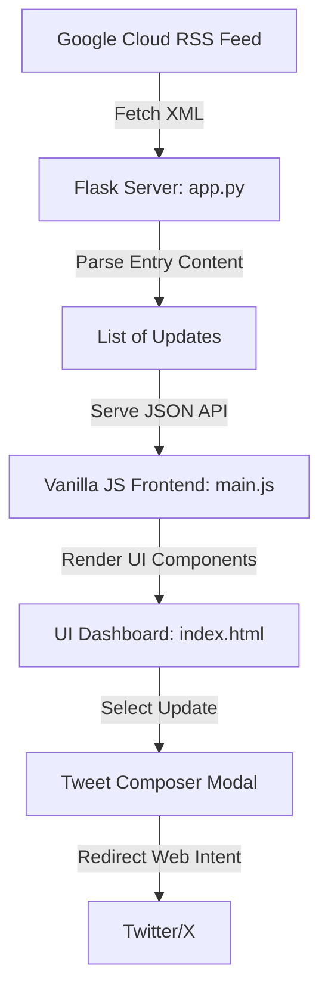

# BigQuery Release Radar

BigQuery Release Radar is a responsive, high-performance, dark-themed Flask web application that aggregates, structures, and showcases release updates from the Google Cloud BigQuery Atom RSS feed (`https://docs.cloud.google.com/feeds/bigquery-release-notes.xml`). 

The application breaks down compound daily feed entries into isolated, filterable items, enabling developers to easily track specific features, announcements, or issues, and share them directly on X/Twitter via an integrated Tweet Composer modal.

---

## 🚀 Key Features

* **Granular Atom Parsing & Splitting**: Google's release feed groups all changes on a single date into one entry. The backend uses Python's `xml.etree.ElementTree` parser and lookahead regular expressions to split these entries into individual update cards.
* **Premium Dark Aesthetics**: Styled with a customized deep-space layout, glassmorphic dialog panels, smooth transitions, custom scrollbars, and dynamic background blur elements.
* **Intelligent Search & Filter Controls**: Client-side query matching against update types, dates, or content, with instant tag toggling (Feature, Change, Issue, Breaking, Announcement).
* **Native Dialog Tweet Composer**: Employs native HTML5 `<dialog closedby="any">` overlays with standard light-dismiss coordinate-checking fallbacks for non-supporting browsers (Safari). Features a visual SVG circular progress ring for character count tracking.
* **On-Demand Synchronization**: Dynamic spin-loading state to manually fetch and display live releases.

---

## 🛠️ Tech Stack & Architecture

### Backend (Server)
* **Python 3.10+ & Flask**: Lightweight WSGI application server.
* **Requests**: Downloads XML data securely with custom `User-Agent` headers.
* **ElementTree & RegEx**: Parses structured Atom feeds and extracts discrete items.

### Frontend (Client)
* **Vanilla HTML5 & CSS3**: Custom styles using CSS variables for theme tokens and layout controls.
* **Vanilla ES6+ JavaScript**: Native browser APIs for asynchronous fetching, filtering, and event delegation.



---

## 📂 Project Structure

```
├── app.py                  # Flask application & Atom parser
├── templates/
│   └── index.html          # HTML dashboard template & modal structure
├── static/
│   ├── css/
│   │   └── style.css       # Core styling, animations & skeletons
│   └── js/
│       └── main.js         # AJAX fetching, search/filtering & modal logic
├── .gitignore              # Files excluded from git
├── README.md               # Project documentation
└── venv/                   # Local Python virtual environment
```

---

## ⚙️ Running Locally

The application runs on local port `5005` by default.

### 1. Set Up Environment
```bash
# Clone the repository
git clone git@github.com:santhosh-kambhampati/santhosh-kambhampati-event-talks-app.git
cd santhosh-kambhampati-event-talks-app

# Create virtual environment (if not already set up)
python3 -m venv venv

# Activate virtual environment
source venv/bin/activate

# Install dependencies
pip install flask requests
```

### 2. Start the Server
```bash
python app.py
```

### 3. Open in Browser
Navigate to **[http://127.0.0.1:5005/](http://127.0.0.1:5005/)** to view the live dashboard.
